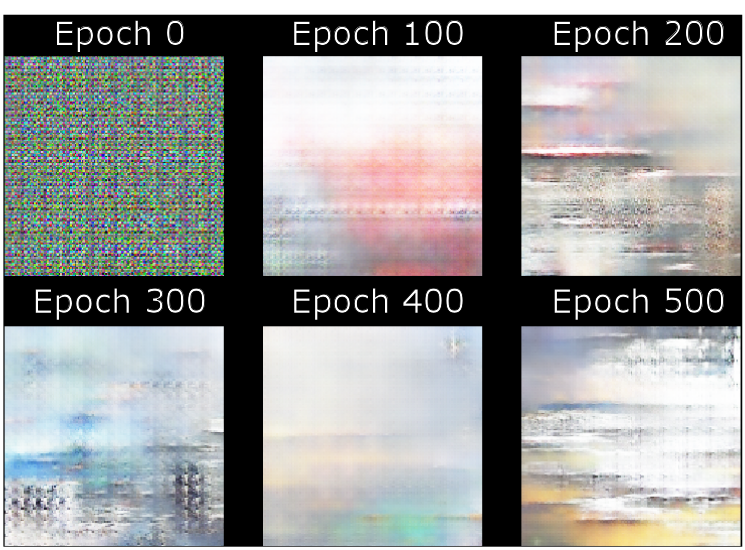
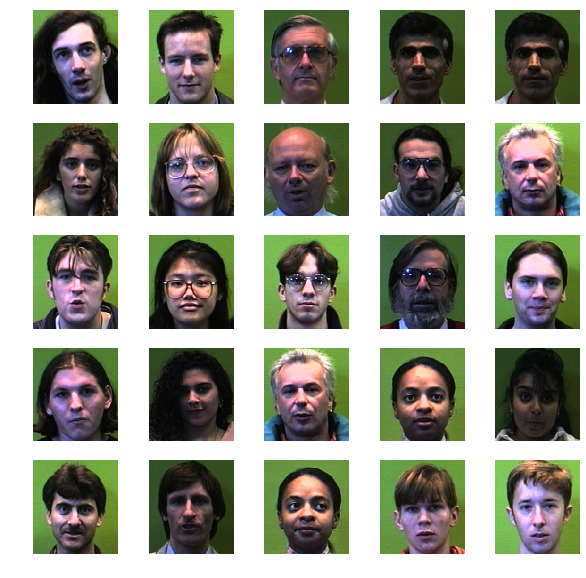
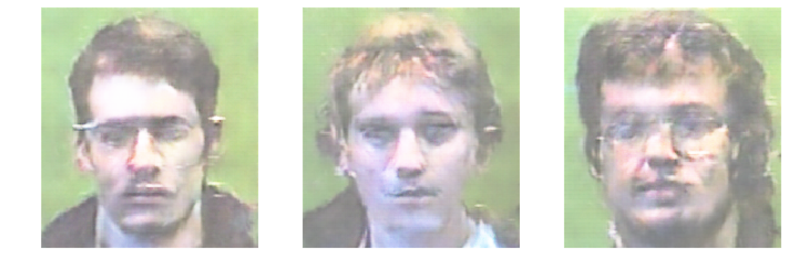

# DCGAN
##General DCGAN architechture implemented in Keras with Tensorflow backend, wraped in convinient API.

The GAN stands for Generative Adversarial Network, and its name is self explanatory. The model consists of the two branches, one generative another is discriminative. The generative branch uses random noise as an input and sequentially transforms this noise into the image. The discriminative branch is used to compare the generated image with the real sample images and to define which one is real and which is fake. The goal of the generative branch, to learn how to "trick" the discriminative branch. The goal of the discriminative is to learn how not to be "tricked". Thus, two branches are competing between each other, establishing a so-called minmax game, which is expressed in minimizing the following loss function:

where D(x) is the output of the discriminative branch (simple Convolutional network) and G(z)is the output of the Generative branch. 

The discriminative branch is a common, well-known Convolutional network, while the generative branch is its reverse, with Convolutional layers replaced by Convolutional transpose, which results in the upsampling.

### Simple use case

Simply provide the path containing the images you want to train on, in the main.py specifying the image size (150,150,3) is default.

### Hyperparameters 

The DCGAN class object can take the following parameters during the intializiation :  

* save_path (str): path to save generated images
* kernel_size (tuple): size of the kernel for Convolutional layer
* stride (tuple): stride size
* input_size (int): input size of the random noise for generator
* img_size (tuple): size of the images to process
* dropout (float): dropout rate
* depth (int): the depth of the generative and discriminative models, i.e. how many Conv2D layers
* increment (int): how much kernels are added with each depth step
* batch_size (int): amount of images to process each training step
* optimizer (func): the optimizer used for generative model

Thus, the model can typically be adapted, based on the needs but the discriminator/generator are symmetric, i.e. the upsampling in generative layer and downsampling in the discriminative layer is the same. 

### Training results
The exact hyperparameters and the following results are dependent on the complexity of the images and purity of the dataset. There is no common solution for any dataset, you will have to play around. For instance, two examples are shown here.

The model was trained on [intel-image-classification database](https://www.kaggle.com/puneet6060/intel-image-classification "intel-image-classification database"), taken from Kaggle. The training is more efficient on single lable data, which is strongly recomended. In this example I am trying to generate images of sea. Starting from this:

the model gradually improves and after 8k epochs starts to give something, resembling at least the paintings of the sea.

There are several parameters to tweek, to obtain good results. The first on is the depth of the network, meaning how many Convolutional layers to use. Another is the increment, which represents the amount of kernels added to each layers. Tuning these two parameters one can adjust the amout of training weights, and the final size of the kernels. Finally, it worth palying around with the Adam optimizer learning rate. Note, very ofter the learning rate for Discriminator and for the Generator are used with some ratio. Nevertheless, the default value of the learning rate must give good enough results, from my experience.

Fo the above results, a very simple (default) configuration was used, with the depth: 4, increment: 32 and thelearning rate of 0.0002 for both branches. The results may still dramatically improve by fine-tuning the model and icreasing its depth.

The next test is performed on the human [faces dataset](https://www.kaggle.com/gasgallo/faces-data-new). The images are simple and all similar, which makes it a perfect test dataset. Some images of the dataset are shown here:

To generate the faces, the depth of the network is increased to 5, since the images are slightely larger (200,180,3). All the other parameters are kept the same for the first round. This model gives pretty good results:

However, after around 3K epochs the model doesn't improve much and seem to overfit. Here are some results after 8K epochs:

Increasing the depth to 6 and increasing the training rate to 0.0008 the model gives some nice results already after 1K epochs, which is really fast, takes around 20 minutes in google colab.

Anyway, I guess such a simple model will not give a better result. For photorealistic results I will improve it in the next iteration.

#Have Fun

